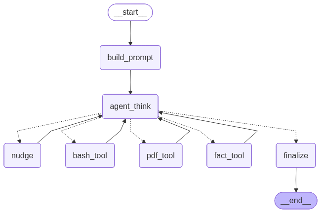

# LangGraph Boilerplate 

A super simple integration of langgraph with redis and ollama, can be tuned in future for specific use cases



## Setup

1. Install dependencies:
```bash
pip install -r requirements.txt
```

2. Make sure Ollama is running:
```bash
ollama serve
```

3. Pull a model (if not already available):
```bash
ollama pull llama2
# or any other model like: ollama pull mistral, ollama pull codellama
```
# use this command to run it

```bash
AGENT_DEBUG=1 python ./app.py
```


